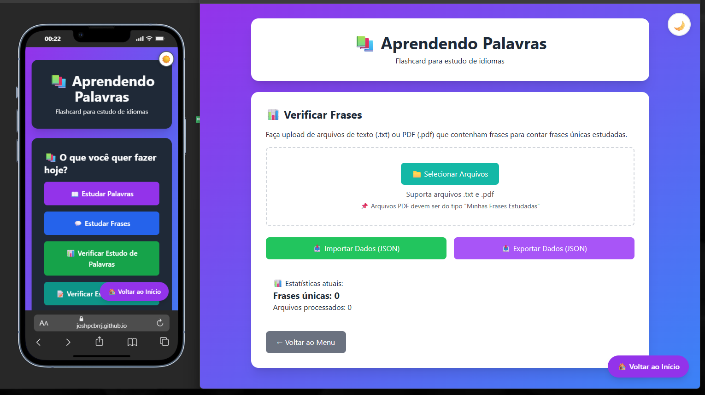

# 📚 Aprendendo Palavras

### Um app web moderno para estudar idiomas com palavras, frases, textos personalizados e revisão prática

**Aprenda, pratique e evolua** com flashcards inteligentes, áudio em vários idiomas, exportação de materiais em PDF e uma experiência de estudo cada vez mais completa.

## 🖥️ **Demonstração**

<div align="center">



*Interface principal do Aplicativo*

</div>

<div align="center">


[](LICENSE)
[](https://joshpcbrrj.github.io/projeto-palavras/)
[](https://nodejs.org/)
[](https://vitejs.dev/)
[](https://jestjs.io/)
[](https://web.dev/progressive-web-apps/)
[](coverage/)

---

### 🚀 [Acesse o App Online](https://joshpcbrrj.github.io/projeto-palavras/)

</div>

---

## ✨ Funcionalidades

### 📖 **Estudo Inteligente**
- 🔍 **Extração automática** - Extraia palavras de qualquer texto
- 📝 **Contexto real** - Estude frases completas, não palavras isoladas
- 🔄 **Revisão eficiente** - Modo aleatório para fixação do conteúdo

### � **Novos fluxos de estudo**
- ✨ **Texto personalizado** - Cole um texto já criado e estude sua leitura em voz alta
- 📂 **Revisão de textos** - Faça upload de arquivos exportados pelo app para revisar conteúdo depois
- 📄 **Exportação em PDF** - Salve textos e materiais de estudo com um padrão organizado para revisão posterior

### 🔊 **Áudio Realista**
- 🌍 **12 idiomas disponíveis** - Inglês, Espanhol, Francês, Italiano, Alemão, Japonês, Chinês, Coreano, Russo, Português (PT/BR)
- 🎯 **Dupla modalidade** - Áudio automático ou sob demanda
- 🎤 **Vozes naturais** - Utiliza Web Speech API do navegador

### 📊 **Análise de Estudo**
- 📄 **Upload de PDFs** - Verifique seu progresso analisando materiais de estudo
- 🔢 **Estatísticas detalhadas** - Contagem de palavras únicas e frequência
- 📑 **Metadados inteligentes** - Importa informações dos seus documentos

### 📈 **Acompanhamento de Progresso**
- 📊 **Dashboard completo** - Visualize seu desempenho por período
- 💾 **Backup local** - Exporte/importe seus dados em JSON
- 🔒 **Persistência automática** - Salvo automaticamente no localStorage

### 🎨 **Interface Moderna**
- 🌙 **Modo escuro** - Ideal para estudo noturno sem cansaço visual
- 📱 **Totalmente responsivo** - Funciona perfeitamente no celular, tablet e desktop
- 💬 **Feedback visual** - Sistema de notificações Toast amigável

### 📄 **Relatórios Personalizados**
- 📑 **Exportação em PDF** - Gere listas de estudo para impressão
- 🏷️ **Metadados ricos** - Dados embutidos para organização
- 🔄 **Suporte dual** - Funciona com palavras, frases e textos personalizados

### 📱 **Progressive Web App (PWA)**
- 📲 **Instalação nativa** - Adicione à tela inicial como um app
- 🌐 **Funciona offline** - Acesse mesmo sem internet
- 🎨 **Ícone personalizado** - Identidade visual na sua área de trabalho

---

## 🛠️ **Tecnologias Utilizadas**

<div align="center">

### Frontend & Estilização
| Tecnologia | Versão | Finalidade |
|------------|--------|------------|
| **HTML5** | - | Estrutura semântica |
| **CSS3** | - | Estilização e animações |
| **JavaScript (ES6+)** | - | Lógica e interatividade |

### Bibliotecas Específicas
| Tecnologia | Versão | Finalidade |
|------------|--------|------------|
| **PDF.js** | 2.16 | Extração de texto de PDFs |
| **jsPDF** | 2.5 | Geração de relatórios |
| **Web Speech API** | - | Síntese de voz |

### Ferramentas de Desenvolvimento
| Tecnologia | Versão | Finalidade |
|------------|--------|------------|
| **Vite** | 5.x | Build e dev server |
| **Jest** | 30.x | Testes unitários |
| **ESLint** | 8.x | Qualidade de código |
| **Prettier** | 3.x | Formatação automática |

### DevOps & Qualidade
| Tecnologia | Versão | Finalidade |
|------------|--------|------------|
| **Husky** | 9.x | Git hooks |
| **lint-staged** | 15.x | Testes pré-commit |
| **GitHub Actions** | - | CI/CD automatizado |

### Progressive Web App
| Tecnologia | Versão | Finalidade |
|------------|--------|------------|
| **Service Workers** | - | Cache offline |
| **Web App Manifest** | - | Instalação do app |
| **Sharp** | 0.33x | Geração de ícones |

</div>

---

## 📊 **Status do Projeto**

<div align="center">

| Métrica | Status |
|---------|--------|
| 🟢 **Build** | [](https://joshpcbrrj.github.io/projeto-palavras/) |
| 🟢 **Testes** | 97% de cobertura |
| 🟢 **PWA** | Instalável e offline |
| 🟢 **Responsivo** | Mobile/Desktop/Tablet |
| 🟢 **Acessível** | WCAG 2.1 compatível |

</div>

---
## 📁 **Estrutura do Projeto**

O projeto segue uma arquitetura limpa e organizada por responsabilidades:

<details>
<summary><b>📂 Clique para expandir a estrutura completa</b> (60+ arquivos organizados)</summary>

```
projeto-palavras/

│

├── 🎯 **Arquivos de Configuração Raiz**

│ ├── 📄 index.html # Entrada principal da aplicação

│ ├── 📄 README.md # Documentação do projeto

│ ├── 📄 package.json # Dependências e scripts npm

│ ├── 📄 package-lock.json # Lockfile das dependências

│ ├── 📄 LICENSE # Licença MIT

│ │

│ ├── **Configurações de Código**

│ │ ├── 📄 eslint.config.js # Regras do ESLint

│ │ ├── 📄 .prettierrc # Formatação do Prettier

│ │ ├── 📄 .prettierignore # Arquivos ignorados pelo Prettier

│ │ ├── 📄 .eslintignore # Arquivos ignorados pelo ESLint

│ │ └── 📄 .gitignore # Arquivos ignorados pelo Git

│ │

│ ├── **Configurações de Testes**

│ │ └── 📄 jest.config.js # Configuração do Jest

│ │

│ ├── **PWA (Progressive Web App)**

│ │ ├── 📄 manifest.json # Configurações do app (nome, ícones, cores)

│ │ ├── 📄 sw.js # Service Worker (cache offline)

│ │ └── 📄 generate-icons.js # Script para gerar ícones automaticamente

│ │

│ └── **Git Hooks**

│ └── 📁 .husky/ # Hooks do Git (pre-commit)

│ └── 📄 pre-commit # Executa testes antes do commit

│

├── 🎨 **Frontend - Estilos**

│ └── 📁 css/

│ ├── 🎨 base.css # Reset e estilos base

│ ├── 🧩 components.css # Componentes customizados

│ └── 🌙 dark-mode.css # Tema escuro completo

│

├── ⚙️ **Frontend - JavaScript Core**

│ └── 📁 js/

│ │

│ ├── **Camada de Aplicação (Apps)**

│ │ └── 📁 apps/

│ │ ├── 🧬 AppBase.js # Classe base abstrata

│ │ ├── 📝 AppPalavras.js # Módulo de palavras

│ │ ├── 💬 AppFrases.js # Módulo de frases

│ │ ├── � AppTextoPersonalizado.js # Estudo e leitura de textos personalizados

│ │ ├── 📂 AppRevisaoTexto.js # Upload e revisão de textos exportados

│ │ ├── �📊 AppAnalisador.js # Análise de PDFs

│ │ └── 📈 AppProgresso.js # Estatísticas de progresso

│ │

│ ├── **Camada Central (Core)**

│ │ └── 📁 core/

│ │ ├── 💾 AppState.js # Gerenciamento de estado global

│ │ ├── ⏱️ AppTimer.js # Timer de estudo

│ │ ├── 🔊 AppAudio.js # Sistema de áudio

│ │ ├── 🧭 AppNavigation.js # Navegação entre telas

│ │ ├── 🌐 AudioIdiomas.js # Suporte a 12 idiomas

│ │ ├── 🎵 AudioPlayer.js # Player de áudio

│ │ ├── 📊 AnalisadorEstatisticas.js # Estatísticas avançadas

│ │ ├── 🔍 AnalisadorExtracao.js # Extração de PDFs

│ │ └── 📑 PDFGenerator.js # Geração de relatórios

│ │

│ ├── **Camada de Modelos (Models)**

│ │ └── 📁 models/

│ │ ├── 📖 PalavrasModel.js # Lógica de processamento de palavras

│ │ └── 💭 FrasesModel.js # Lógica de processamento de frases

│ │

│ ├── **Camada de Serviços (Services)**

│ │ └── 📁 services/

│ │ ├── 💾 StorageService.js # Persistência (localStorage)

│ │ ├── ✅ ValidatorService.js # Validação de dados

│ │ ├── 🔀 ShufflerService.js # Embaralhamento inteligente

│ │ ├── 📊 ProgressService.js # Gestão de progresso

│ │ ├── ⚠️ ErrorHandler.js # Tratamento global de erros

│ │ ├── 📝 TextoPersonalizadoService.js # Formato padronizado para textos exportados/importados

│ │ └── ⏳ LoadingManager.js # Estados de carregamento

│ │

│ ├── **Camada de Interface (UI)**

│ │ └── 📁 ui/

│ │ ├── 🌓 ThemeManager.js # Alternância claro/escuro

│ │ ├── 🔙 NavigationManager.js # Botão voltar

│ │ ├── 🌍 AudioUISelector.js # Seletor de idioma/velocidade

│ │ ├── 📊 AnalisadorUI.js # UI do analisador

│ │ ├── 📈 ProgressoUI.js # UI do progresso

│ │ └── 🔔 Toast.js # Sistema de notificações

│ │

│ ├── ⚙️ config.js # Configurações globais (constantes, URLs)

│ └── 🚀 app.js # Ponto de entrada, menu principal

│

├── 🧪 **Testes**

│ └── 📁 tests/

│ ├── ⚙️ config.test.js # Testes de configuração

│ ├── ⚠️ errorhandler.test.js # Testes do ErrorHandler

│ ├── 💬 frases.test.js # Testes do modelo de frases

│ ├── ⏳ loadingmanager.test.js # Testes do LoadingManager

│ ├── 📖 palavras.test.js # Testes do modelo de palavras

│ ├── 📊 progress.test.js # Testes do ProgressService

│ ├── 🔀 shuffler.test.js # Testes do ShufflerService

│ ├── 💾 storage.test.js # Testes do StorageService

│ ├── ✅ validator.test.js # Testes do ValidatorService

│ └── 🧪 sample.test.js # Teste de verificação do Jest

│

├── 🖼️ **Assets e Ícones PWA**

│ └── 📁 icons/

│ ├── 🖼️ icon-72.png

│ ├── 🖼️ icon-96.png

│ ├── 🖼️ icon-128.png

│ ├── 🖼️ icon-144.png

│ ├── 🖼️ icon-152.png

│ ├── 🖼️ icon-192.png

│ ├── 🖼️ icon-384.png

│ └── 🖼️ icon-512.png

│

├── 📊 **Relatórios (Gerados)**

│ └── 📁 coverage/ # Relatórios de cobertura de testes (npm run test:coverage)

│

└── 🏗️ **Build de Produção (Gerado)**

└── 📁 dist/ # Build otimizado (npm run build)
```

</details>

## 🚀 **Como Executar o Projeto**

### 📋 **Pré-requisitos**

Antes de começar, você vai precisar ter instalado em sua máquina:

| Requisito | Versão | Onde obter |
|-----------|--------|------------|
| 🌐 **Navegador moderno** | Chrome 90+, Firefox 88+, Edge 90+, Safari 14+ | [Chrome](https://www.google.com/chrome/) \| [Firefox](https://www.mozilla.org/firefox/) |
| 💻 **Node.js** | 18.x ou superior | [https://nodejs.org](https://nodejs.org) |
| 📦 **npm** | 9.x ou superior | Já vem com o Node.js |
| 🌍 **Conexão com internet** | - | Para baixar dependências e CDNs |

> 💡 **Dica:** Para verificar se o Node.js está instalado corretamente, abra o terminal e execute:
> ```bash
> node --version  # Deve mostrar v18.0.0 ou superior
> npm --version   # Deve mostrar 9.0.0 ou superior
> ```

---

### 📥 **Instalação e Execução**

<details>
<summary><b>🐧 Passo a passo para Windows/Mac/Linux</b> (Clique para expandir)</summary>

#### 1️⃣ **Clone ou baixe o projeto**

**Opção A - Clonar com Git (recomendado):**
```bash
git clone https://github.com/Joshpcbrrj/projeto-palavras.git
cd projeto-palavras
```

**Opção B - Baixar como ZIP:**
Acesse https://github.com/Joshpcbrrj/projeto-palavras

Clique em "Code" → "Download ZIP"

Extraia a pasta e acesse pelo terminal


#### 2️⃣ Instale as dependências

```bash
npm install
```

⏱️ Este processo pode levar alguns minutos na primeira vez.


#### 3️⃣ Execute o projeto

Modo Desenvolvimento (com hot reload):

```bash
npm run dev
```
- O servidor iniciará em `http://localhost:5173/`
- Qualquer alteração no código atualiza a página automaticamente

**Modo Produção (build otimizado):**

```bash
npm run build      # Gera a pasta dist/
npm run preview    # Visualiza o build localmente
```

#### 4️⃣ Abra no navegador

- Se estiver usando `npm run dev`: Acesse `http://localhost:5173/`
- Se estiver usando `npm run preview`: Acesse `http://localhost:4173/`

</details>

**🎯 Métodos Alternativos (sem Node.js)**

<details> <summary><b>📂 Métodos para quem não tem Node.js instalado</b> (Clique para expandir)</summary>

### **Opção 1 - Live Server (VS Code)**

1. Instale a extensão **"Live Server"** no VS Code
2. Abra a pasta do projeto no VS Code
3. Clique com botão direito no `index.html`
4. Selecione **"Open with Live Server"**

### **Opção 2 - Direto no navegador**

1. Navegue até a pasta do projeto pelo Explorador de Arquivos
2. Dê duplo clique no arquivo `index.html`
3. ⚠️ *Pode haver limitações com recursos modernos (ES6 modules, PWA)*

### **Opção 3 - Usar o app online (recomendado)**

- Acesse diretamente: https://joshpcbrrj.github.io/projeto-palavras/
- ✅ Sem necessidade de instalação local
- ✅ Funcionamento garantido

</details>


### 🧪 **Executando os Testes**

<details>
<summary><b>✅ Testes automatizados</b> (Clique para expandir)</summary>

```bash
# Executar todos os testes uma vez
npm test

# Executar testes em modo watch (atualiza automaticamente ao salvar)
npm run test:watch

# Executar testes com relatório de cobertura
npm run test:coverage
```

**Exemplo de saída esperada:**

```bash
 PASS  tests/validator.test.js
 PASS  tests/storage.test.js
 PASS  tests/palavras.test.js
...
Test Suites: 9 passed, 9 total
Tests:       47 passed, 47 total
Coverage:    97.23%
```

</details>

### 🔧 **Comandos Úteis**

| Comando | Descrição |
|---------|-----------|
| `npm run dev` | Inicia servidor de desenvolvimento (hot reload) |
| `npm run build` | Gera build otimizado para produção |
| `npm run preview` | Visualiza o build de produção localmente |
| `npm test` | Executa todos os testes |
| `npm run test:coverage` | Executa testes e gera relatório de cobertura |
| `npm run lint` | Verifica problemas de código |
| `npm run lint:fix` | Corrige problemas automaticamente |
| `npm run format` | Formata todo o código com Prettier |
| `npm run icons` | Gera os ícones do PWA (caso necessário) |

---

### 🐛 **Solução de Problemas Comuns**

<details>
<summary><b>⚠️ Problemas e soluções</b> (Clique para expandir)</summary>

#### **Erro: `node: command not found`**
- **Problema:** Node.js não está instalado
- **Solução:** Baixe e instale em [nodejs.org](https://nodejs.org)

#### **Erro: `npm install` falha**
- **Problema:** Problemas de rede ou permissão
- **Solução:**

```bash
  # Limpar cache do npm
  npm cache clean --force
  
  # Tentar novamente
  npm install
```


#### **Erro: `Port 5173 already in use`**
- **Problema:** Porta já está sendo usada
- **Solução:** Altere a porta no arquivo `vite.config.js` ou mate o processo anterior

#### **PWA não instala no navegador**
- **Problema:** Servidor precisa ser HTTPS ou localhost
- **Solução:** Use `npm run preview` que já serve em HTTPS local

#### **Áudio não funciona**
- **Problema:** Navegador bloqueou autoplay
- **Solução:** Clique em qualquer lugar da página primeiro ou verifique as permissões

</details>

---

### ✅ **Verificação de Instalação Bem-sucedida**

Após executar `npm run dev`, você deverá ver algo como:

```bash
  VITE v5.x.x  ready in 500 ms

  ➜  Local:   http://localhost:5173/
  ➜  Network: use --host to expose
  ➜  press h + enter to show help
```

Acesse o link e você verá a tela principal do **Aprendendo Palavras**! 🎉

---

## 🌐 **Acesse Online (Sem instalação)**

Se você não quer instalar nada, o projeto já está disponível online:

<div align="center">

### 🔗 **[https://joshpcbrrj.github.io/projeto-palavras/](https://joshpcbrrj.github.io/projeto-palavras/)**

[](https://joshpcbrrj.github.io/projeto-palavras/)

</div>

---

## 📦 **Dependências do Projeto**

| Dependência | Versão | Finalidade |
|-------------|--------|------------|
| `vite` | ^5.0.0 | Servidor de desenvolvimento e build |
| `jest` | ^30.4.2 | Framework de testes unitários |
| `eslint` | ^8.57.0 | Padronização e qualidade de código |
| `prettier` | ^3.2.0 | Formatação automática de código |
| `husky` | ^9.0.0 | Git hooks para execução de scripts |
| `lint-staged` | ^15.2.0 | Executa testes apenas em arquivos modificados |
| `sharp` | ^0.33.0 | Geração de ícones PWA |

### **Configuração do `package.json`**

```json
{
  "name": "aprendendo-palavras",
  "version": "2.0.0",
  "description": "Flashcard para estudo de idiomas",
  "type": "module",
  "scripts": {
    "dev": "vite",
    "build": "vite build",
    "preview": "vite preview",
    "test": "jest",
    "test:watch": "jest --watch",
    "test:coverage": "jest --coverage",
    "lint": "eslint js/**/*.js --ignore-pattern '**/tests/**'",
    "lint:fix": "eslint js/**/*.js --fix --ignore-pattern '**/tests/**'",
    "format": "prettier --write .",
    "format:check": "prettier --check .",
    "prepare": "husky",
    "icons": "node generate-icons.js"
  },
  "lint-staged": {
    "*.js": [
      "eslint --fix --ignore-pattern '**/tests/**'",
      "prettier --write",
      "jest --bail --findRelatedTests --passWithNoTests"
    ],
    "*.{json,md}": [
      "prettier --write"
    ]
  },
  "devDependencies": {
    "@eslint/js": "^8.57.0",
    "eslint": "^8.57.0",
    "husky": "^9.0.0",
    "jest": "^30.4.2",
    "jest-environment-jsdom": "^29.0.0",
    "lint-staged": "^15.2.0",
    "prettier": "^3.2.0",
    "sharp": "^0.33.0",
    "vite": "^5.0.0"
  }
}
```
### **Configuração do PWA**

#### 1. Gerar os ícones

```bash
# Instalar sharp para geração de ícones
npm install -D sharp

# Gerar os ícones automaticamente
npm run icons
```

#### 2. Arquivos do PWA

| **Arquivo** | **Descrição** |
| --- | --- |
| `manifest.json` | Configurações do app (nome, ícones, cores) |
| `sw.js` | Service Worker para cache offline |
| `icons/` | Ícones para diferentes tamanhos de tela |

### **Configuração do ESLint**

Crie o arquivo `eslint.config.js` na raiz do projeto:

```js
// eslint.config.js
import js from "@eslint/js";

export default [
  js.configs.recommended,
  {
    files: ["**/*.js"],
    ignores: [
      "node_modules/**",
      "dist/**",
      "coverage/**",
      "tests/**/*.test.js",
      "**/*.config.js"
    ],
    languageOptions: {
      ecmaVersion: "latest",
      sourceType: "module",
      globals: {
        window: "readonly",
        document: "readonly",
        localStorage: "readonly",
        confirm: "readonly",
        alert: "readonly",
        console: "readonly",
        pdfjsLib: "readonly",
        jspdf: "readonly",
        CONFIG: "readonly"
      }
    },
    rules: {
      "no-console": "off",
      "no-unused-vars": "off",
      "no-undef": "off",
      "no-useless-assignment": "off"
    }
  }
];
```

### **Configuração do Prettier**

Crie o arquivo `.prettierrc` na raiz do projeto:

```json
{
  "semi": true,
  "singleQuote": true,
  "tabWidth": 2,
  "trailingComma": "es5",
  "printWidth": 100,
  "bracketSpacing": true,
  "arrowParens": "always",
  "endOfLine": "auto"
}
```

### **Configuração do Jest**

Crie o arquivo `jest.config.js` na raiz do projeto:

```javascript
// jest.config.js
module.exports = {
  testEnvironment: 'jsdom',
  verbose: true,
  collectCoverage: true,
  coverageDirectory: 'coverage',
  coverageReporters: ['text', 'lcov'],
  testMatch: ['**/tests/**/*.test.js'],
};
```

### **Comandos disponíveis**

| Comando | Descrição |
|---------|-----------|
| `npm install` | Instala todas as dependências do projeto |
| `npm run dev` | Inicia servidor de desenvolvimento com hot reload |
| `npm run build` | Gera versão otimizada para produção na pasta `dist/` |
| `npm run preview` | Visualiza a versão de produção localmente |
| `npm run icons` | Gera os ícones do PWA |
| `npm test` | Executa todos os testes uma vez |
| `npm run test:watch` | Executa testes e fica observando mudanças |
| `npm run test:coverage` | Executa testes com relatório de cobertura |
| `npm run lint` | Verifica problemas de código com ESLint |
| `npm run lint:fix` | Corrige problemas automaticamente |
| `npm run format` | Formata todo o código com Prettier |
| `npm run format:check` | Verifica formatação sem alterar |

### **Git Hooks (Husky)**

Após instalar as dependências, configure os Git hooks:

```bash
# Inicializa o Husky
npx husky init
```

Isso criará a pasta `.husky/` com o arquivo `pre-commit`. O hook `pre-commit` executará automaticamente:
- ESLint nos arquivos modificados
- Prettier para formatação
- Jest para testes relacionados

## 👨‍💻 **Autor**

<div align="center">

**Desenvolvido com dedicação para facilitar o aprendizado de idiomas.**

---

### 📫 **Contato e Redes**

[](https://github.com/Joshpcbrrj)
[](https://www.linkedin.com/in/josualmeida/)
[](mailto:joshpcbrrj@gmail.com)

</div>

---

## 🙏 **Agradecimentos**

- 🌟 **A todos que testaram e deram feedback** durante o desenvolvimento
- 📚 **À comunidade open source** pelas ferramentas incríveis (Vite, Jest, PDF.js, jsPDF)
- 🎓 **Aos professores e mentores** que incentivaram o projeto
- 🚀 **A você, usuário** por utilizar e valorizar o projeto

---

## ⭐ **Contribua com o projeto**

Se este projeto te ajudou de alguma forma:

- 🔗 **Compartilhe com alguém** que esteja aprendendo idiomas
- 🐛 **Reporte bugs** abrindo uma [issue](https://github.com/Joshpcbrrj/projeto-palavras/issues)
- ⭐ **Dê uma estrela** no repositório para ajudar na divulgação
- 💡 **Sugira melhorias** através das issues

---

<div align="center">

**Feito com ☕ e JavaScript**

</div>